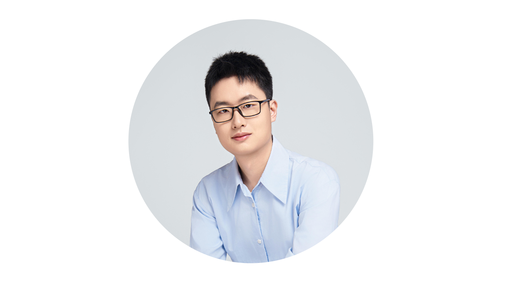

 
 <h2 align="center">您好，我是
  <a href="https://theia-4869.github.io/cn/">张启哲</a>！
 </h2>
 
 
  

    <a href="/README.md">English</a>
    ·
    <a href="/README_CN.md">简体中文</a>
  

## 👤 关于我

我目前是[北京大学](https://www.pku.edu.cn/)[计算机学院](https://cs.pku.edu.cn/)[视频与视觉技术国家工程研究中心 (NERCV²T)](https://idm.pku.edu.cn/)[HMI实验室](https://pku-hmi-lab.github.io/HMI-Web/)的一名在读博士生，导师是[仉尚航](https://www.shanghangzhang.com/)教授。我在2023年于北京大学获得了图灵班智能方向的学士学位，同时还取得了经济学双学位。

### 🔭 科研兴趣

我的研究兴趣集中于计算机视觉与多模态学习，包括视觉基础模型、多模态大模型、视觉复杂推理、视觉令牌压缩、视觉持续学习与具身智能。我的总体研究目标是构建出一套具有类人表达、适应与泛化能力的大规模高效视觉感知系统，表现出包括基础感知、认知推理与自主创造在内的强大能力。

## 📬 联系方式

📧 电子邮件: theia@pku.edu.cn, theia4869@gmail.com

欢迎随时联系我合作！
